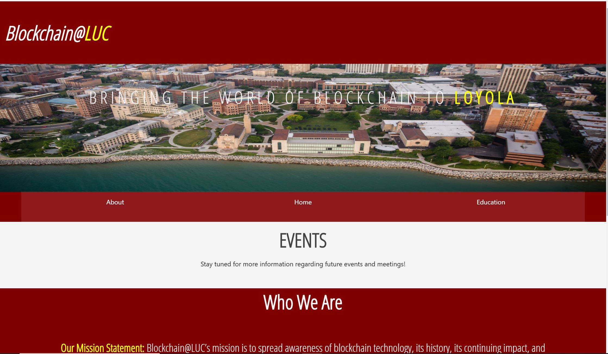

## Blockchain@LUC Website

This is the official website for the Blockchain@LUC SSO for Loyola University Chicago students 
to explore all things Bitcoin and BLockchain.

This project is currently a website mainly for information regarding the club. In the future, this site will become more of
a web-app where users can progress through certain fundamental courses to learn the basics of bitcoin & blockchain on the side. 

Educational content will be provided in the "Education" section and members can learn the basics of bitcoin and blockchain at
their own pace.

Club Website Link: https://blockchainluc.org/

## Languages/Tools/Services 

This website was coded in ReactJS, HTML/CSS. Firebase (GCP) was used to host the website. Google Domains was used to set up a domain.

## About
Creator: Mohammed Patel

2nd Year Computer Science & Software Engineering Student at Loyola University Chicago

Lead Website Developer for Blockchain@LUC

Feel free to email me @Mopatel1214@gmail.com for any questions, comments, or concerns. :)
